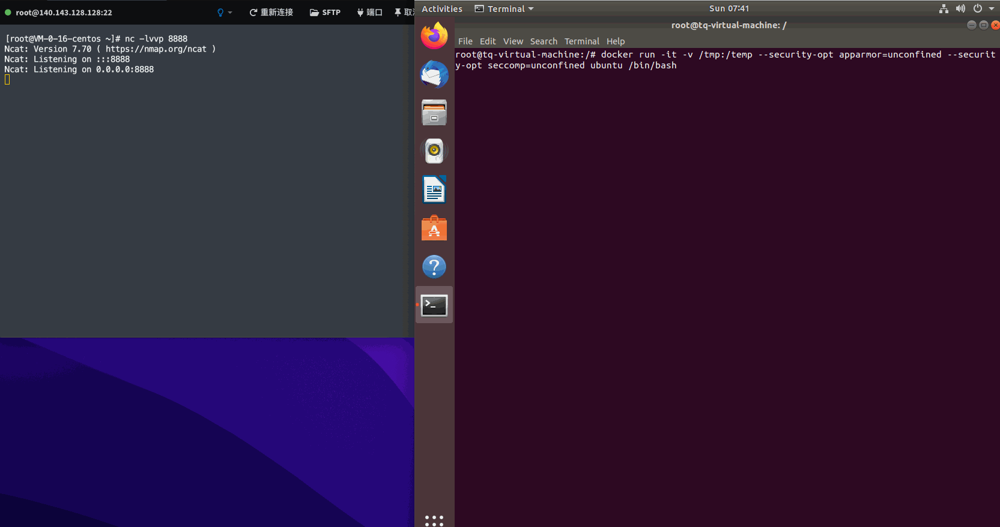

## Shovel

Docker容器逃逸工具

1、通过mount命令逃逸触发告警？

2、unshare命令发现没有-C参数？

3、机器上没有各种语言的执行环境？

4、逃逸程序太大不好下载？

遇到以上问题那就用下这个程序吧，原理上就是逃逸的那一堆shell脚本，换成系统调用，绕过bash的监控



## 功能

* 支持的逃逸方式
  * release_agent
  * device_allow
  * cve-2022-0492


* 支持的存储驱动
  * device_mapper
  * aufs
  * btrfs
  * vfs
  * zfs
  * overlayfs


* 支持的利用类型
  * exec: 在宿主机执行命令
  * shell: 获取宿主机shell
  * reverse: 反弹shell
  * backdoor: 向宿主机植入后门并运行


* 自动清理攻击痕迹

## 使用方式

```text
usage: shovel [options ...]

Options:
Options of program
    -h, --help                           show help message
    -v, --version                        show program version
Options of escape
    -r, --release-agent                  escape by release-agent
    -d, --devices-allow                  escape by devices-allow
    -u, --cve-2022-0492                  get cap_sys_admin by cve-2022-0492 and return new namespace bash
Options of other
    -p, --container_path=xxx             manually specify path of container in host,use this parameter if program can't get it automatically
    -m, --mode=xxx                       the mode that needs to be returned after a successful escape { exec | shell | reverse | backdoor }
    -c, --command=xxx                    set command in exec mode
    -I, --ip                             set ip address in reverse mode
    -P, --port                           set port in reverse mode
    -B, --backdoor_path                  set backdoor file path
    -y, --assumeyes                      automatically answer yes for all questions
Mode (-m) type guide
    exec:     run a single command and return the result
    shell:    get host shell in current console
    reverse:  reverse shell to remote listening address
    backdoor: put a backdoor to the host and execute
```
## 编译

编译时尽量用低版本glibc，高版本glibc编译到老系统上没办法运行

编译环境如果是Linux 4.6前，没有CLONE_NEWCGROUP常量,或者其他情况编译时出现以下报错

```text
/docker/opt/shovel/exploits/cve_2022_0492.c:30: error: 'CLONE_NEWCGROUP' undeclared (first use in this function)
```

可以用[no_0492](https://github.com/SPuerBRead/shovel/tree/no_0492) 这个branch的代码，这个版本的代码不包含cve-2022-0492的exp，换掉了一些c99的写法，使其尽可能在老机器上可以编译


```shell
cmake .
make
```